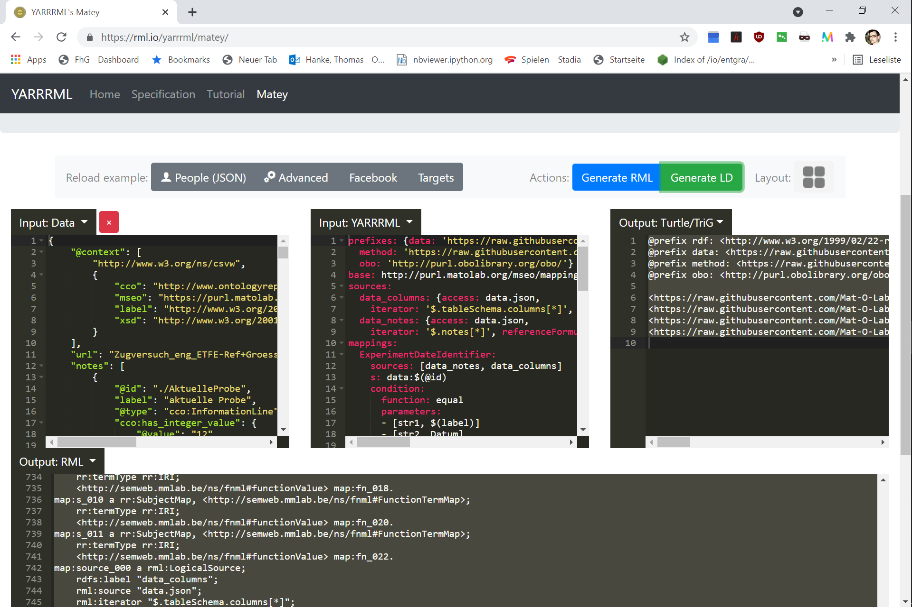

# MapToMethod
Tool to map content of JSON-LD files (output of CSVtoCSVW) describing CSV files to Information Content Entities in knowledge graphs describing methods in the method folder of the MSEO Ontology repository at https://github.com/Mat-O-Lab/MSEO.

# how to use
1. Open the notebook in [google colab](https://colab.research.google.com) or any other jupyter instance.
2. Run the first cell of the notebook. It will install the necesary python packages and definitions.
3. Run the second cell
4. Upload a csvw meta file in JSON-LD or paste in a url pointing at one in the provided widgets.
5. Select if the tables represented in the json-ld is for one experiment only (primary data) or has multiple lines represeting an experiment one each (secondary data - not supported in the moment).
6. Select the method graph u like to map against, the dropdown only options of files in the method folder of the [MSEO Repository](https://github.com/Mat-O-Lab/MSEO)
7. Click the start mapping button, it will query all InformationLine and Column entities in the json-ld and creates widgets for all Information Content Entities in the selected method knowledge graph. 
8. Map all Entities by selecting the suitable dropdown choices for the indevidual Information Content Entities, and hit the create mapping button when ready.
9. If successfull, a YARRRML file is returned wich u can download by clicking the download button.

# additional information
The tools output is a yml file conform to [YARRRML](https://rml.io/yarrrml). The syntax lets u put down mapping rules that can be read by humans more easy then pure RML.
To try the mapping you can use [Matey](https://rml.io/yarrrml/matey/). Paste your json-ld in the left tab and the yml output into the Input: YARRRML.
You will habe to replace the url locations under sources with data.json, to point at the left Input: Data where u pastes the json-ld data.
Now u can run the RML generation and also directly create RDF by clicking the the Generate LD Button afterwards. 

